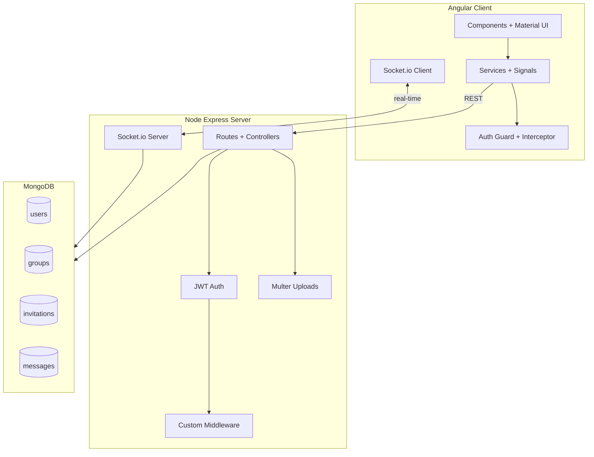
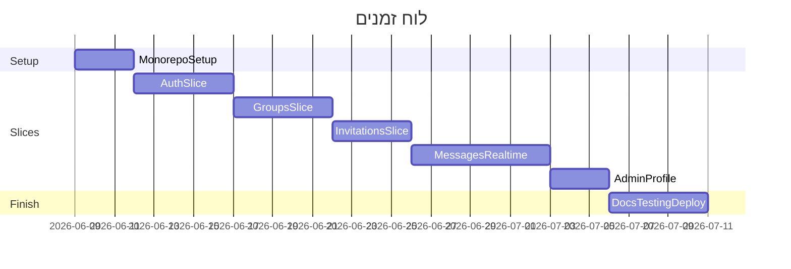

# תכנון עבודה — פרויקט צ'אט (Node.js + Angular + MongoDB)

**מסמכים קשורים:**
- [work-tamar-zisman.md](work-tamar-zisman.md) — קובץ עבודה אישי (תמר)
- [work-shoshi-sefrai.md](work-shoshi-sefrai.md) — קובץ עבודה אישי (שושי)

---

## סמן מיקום

| | |
|---|---|
| **שלב נוכחי** | שלב 0 — הקמה משותפת |
| **Slice פעיל** | Slice 0 |
| **Branch פעיל** | `main` |
| **משימה עכשיו** | יצירת Monorepo + GitHub |
| **עודכן לאחרונה** | 2026-06-08 |
| **עודכן על ידי** | שתיהן |

> עדכנו שדה זה בכל מעבר שלב — בסוף כל שבוע עבודה לפחות.

### איך לעדכן

1. בסיום משימה / מעבר Slice — עדכני את הטבלה + תאריך
2. הזיזי את `▶ **[שלב נוכחי]**` לכותרת השלב החדשה
3. עדכני גם את מסמכי העבודה האישיים (תמר + שושי) — סנכרון צוות

---

## סקירה

**פרויקט:** אפליקציית צ'אט Fullstack — ניהול קבוצות, משתמשים, הזמנות והודעות (CRUD מלא).

**צוות:** תמר זיסמן + שושי ספראי

**טכנולוגיות (גרסאות עדכניות):**
- **Server:** Node.js (LTS אחרון) + Express + Mongoose + JWT + bcrypt + Multer + Socket.io
- **Client:** Angular 20 (standalone components, Signals, Reactive Forms) + Angular Material + HttpClient
- **DB:** MongoDB Atlas (מומלץ) / Compass לייצוא מקומי
- **State:** Angular Signals + Services (לא NgRx)
- **Git:** Monorepo — `server/` + `client/` + README ראשי
- **שפה:** אנגלית, LTR

**עקרון חלוקה:** חלוקה לפי **Vertical Slices** (פיצ'רים) — כל אחת **בעלים ראשית** על חלק מהפיצ'רים, אבל **חובה לגעת בכל שכבה** (Schema, API, Middleware, Component, Service, Validation, Tests ידניים). השנייה עושה **Code Review + משימות משניות חובה** בכל slice.

---

## ארכיטקטורה כללית



---

## מבנה Monorepo

```
node-angular-project/
├── README.md                  # תיאור כללי + הוראות הרצה
├── .gitignore
├── docs/                      # מסמכי קדם-הגשה
│   ├── work-plan.md           # תכנון עבודה ראשי (קובץ זה)
│   ├── work-tamar-zisman.md   # קובץ עבודה — תמר
│   ├── work-shoshi-sefrai.md  # קובץ עבודה — שושי
│   ├── server-analysis.md     # תרשים פעולות לפי משתמש
│   ├── database-analysis.md   # אוספים + קשרים
│   └── screens-analysis.md    # מסכים + קומפוננטות
├── server/
│   ├── .env.example
│   ├── README.md
│   ├── src/
│   │   ├── config/
│   │   ├── models/            # User, Group, Invitation, Message
│   │   ├── routes/
│   │   ├── controllers/
│   │   ├── middleware/        # auth, errorLogger, shabbatBlock (custom)
│   │   ├── services/
│   │   ├── sockets/
│   │   └── utils/
│   └── uploads/               # תמונות, אודיו, PDF
└── client/
    ├── .env.example
    ├── README.md
    └── src/app/
        ├── core/              # auth, interceptors, guards
        ├── shared/            # כפתורים, כרטיסים, טופס משותף
        └── features/
            ├── auth/
            ├── groups/
            ├── invitations/
            └── chat/
```

---

## מסד נתונים — 4 אוספים (מינימום 2)

| Collection | שדות עיקריים | קשרים |
|---|---|---|
| **users** | username, email, passwordHash, avatar (image), role (`user`/`admin`) | ref ב-groups, messages |
| **groups** | name, description, adminId, members[], avatar (image) | admin → users, members → users |
| **invitations** | groupId, invitedUserId, invitedBy, status (`pending`/`accepted`/`rejected`) | refs → groups, users |
| **messages** | groupId, senderId, text, attachments[] (image/audio/pdf), timestamps | refs → groups, users |

**דרישות Mongoose (חובה):** כל model יכלול לפחות אחד מ: `pre` hook (hash password), `static` method (findByEmail), `toJSON` (הסתרת password).

**סוגי מדיה (חובה):**
- **טקסט** — תוכן הודעות, שמות קבוצות
- **תמונות** — avatar משתמש/קבוצה (Multer)
- **אודיו** — קובץ מצורף להודעה
- **PDF** (אופציונלי) — קובץ מצורף נוסף

---

## סוגי משתמשים והרשאות

| פעולה | משתמש רגיל | מנהל קבוצה (יוצר) |
|---|---|---|
| הרשמה / התחברות | ✓ | ✓ |
| צפייה בקבוצות שלי | ✓ | ✓ |
| יצירת קבוצה (הופך למנהל) | ✓ | ✓ |
| הזמנת משתמש לקבוצה | ✓ (חבר) | ✓ |
| קבלה/דחיית הזמנה | ✓ | ✓ |
| מחיקת חבר מקבוצה | ✗ | ✓ |
| CRUD הודעות + קבצים | ✓ (שלו) | ✓ |
| יציאה מקבוצה | ✓ | ✓ |
| מחיקת קבוצה | ✗ | ✓ |

**Auth:** JWT ב-Header, `AuthGuard` + `RoleGuard` / `GroupAdminGuard` ב-Angular, `authMiddleware` + `isGroupAdmin` בשרת.

---

## מסכים וקומפוננטות (Client)

| מסך | Route | קומפוננטות |
|---|---|---|
| Login | `/login` | LoginForm |
| Register | `/register` | RegisterForm |
| Dashboard | `/groups` | GroupList, GroupCard |
| Create/Edit Group | `/groups/new`, `/groups/:id/edit` | GroupForm (shared — id param) |
| Group Detail / Chat | `/groups/:id` | ChatRoom, MessageList, MessageItem, MessageForm |
| Invitations | `/invitations` | InvitationList, InvitationActions |
| Profile | `/profile` | ProfileForm, AvatarUpload |
| Navbar | global | NavBar (links לפי auth state) |
| Routes | global | AppRoutes |

**דרישות UI:** Angular Material, Responsive (Desktop: sidebar + chat / Mobile: hamburger + full-width), **ללא inline styles**, CSS/SCSS נפרד לפי צורך.

---

## API Endpoints (Server)

```
POST   /api/auth/register
POST   /api/auth/login
GET    /api/auth/me

GET    /api/groups
POST   /api/groups
GET    /api/groups/:id
PUT    /api/groups/:id          # admin only
DELETE /api/groups/:id          # admin only
POST   /api/groups/:id/leave
POST   /api/groups/:id/invite
DELETE /api/groups/:id/members/:userId  # admin only

GET    /api/invitations
PUT    /api/invitations/:id/accept
PUT    /api/invitations/:id/reject

GET    /api/groups/:id/messages
POST   /api/groups/:id/messages         # + multer
PUT    /api/messages/:id                # owner only
DELETE /api/messages/:id                # owner or admin
```

**Socket.io events:** `joinGroup`, `leaveGroup`, `newMessage`, `messageUpdated`, `messageDeleted`

---

## Custom Middleware (חובה — כל אחת אחד)

| Middleware | בעלים | תיאור |
|---|---|---|
| `errorLogger` | **תמר** | ב-dev: console; ב-production: כתיבה לקובץ log |
| `requestValidator` / `rateLimiter` | **שושי** | middleware creator — factory function עם פרמטרים |

דוגמה ל-pattern (middleware creator):
```javascript
const createRateLimiter = (maxRequests, windowMs) => (req, res, next) => { ... }
```

---

## חלוקת עבודה — תמר זיסמן vs שושי ספראי

### עקרון: "Primary + Secondary + Cross-Cutting"

כל slice כולל 4 שכבות: **DB → API → Client Service → UI**.  
הבעלים הראשית עושה ~70%, המשנית ~30% (חובה).

---

### ▶ **[שלב נוכחי]** שלב 0 — הקמה משותפת (יום 1–2, **שתיהן ביחד**)

- [ ] יצירת Monorepo + GitHub repo
- [ ] `server`: Express scaffold, `.env`, חיבור MongoDB
- [ ] `client`: `ng new` עם routing, Material, standalone
- [ ] הגדרת `.env.example` בשני הצדדים
- [ ] הסכמה על conventions: naming, branch strategy (`main`, feature branches)
- [ ] יצירת `docs/` עם templates לקדם-הגשה

---

### Slice 1 — Auth (התחברות / הרשמה / JWT)

| משימה | תמר (Primary) | שושי (Secondary) |
|---|---|---|
| **DB** | User model + pre hash + toJSON | Review + static `findByEmail` |
| **API** | auth routes, register/login controllers, JWT sign | Review + validation middleware |
| **Middleware** | `authMiddleware` — verify JWT | `errorLogger` middleware |
| **Client Service** | AuthService + Signals (user state) | HTTP interceptor (attach token) |
| **UI** | RegisterComponent + validation | LoginComponent + AuthGuard |
| **Validation** | Server: express-validator on register | Client: Reactive Forms validators |

**תוצר:** הרשמה, התחברות, logout, protected routes.

---

### Slice 2 — Groups (יצירה, רשימה, ניהול)

| משימה | שושי (Primary) | תמר (Secondary) |
|---|---|---|
| **DB** | Group model + refs + validation | Review + indexes |
| **API** | CRUD groups, leave group, admin check | Review + tests in Thunder Client |
| **Middleware** | `isGroupAdmin` middleware | Review |
| **Client Service** | GroupService + group Signal store | Review |
| **UI** | GroupList, GroupCard, GroupForm (add/edit by id) | NavBar links by role |
| **Validation** | Server: group name required, min length | Client: Reactive Forms |

**תוצר:** יצירת קבוצה, רשימת קבוצות, עריכה/מחיקה (admin), יציאה.

---

### Slice 3 — Invitations (הזמנות)

| משימה | תמר (Primary) | שושי (Secondary) |
|---|---|---|
| **DB** | Invitation model + status enum | Review |
| **API** | invite, list, accept, reject endpoints | Review |
| **Client Service** | InvitationService + Signal | Review |
| **UI** | InvitationList + accept/reject buttons | Badge/count in NavBar |
| **Validation** | Server: user exists, not already member | Client: confirm dialog |

**תוצר:** הזמנה לקבוצה, צפייה בהזמנות, קבלה/דחייה.

---

### Slice 4 — Messages + Media + Real-time

| משימה | שושי (Primary) | תמר (Secondary) |
|---|---|---|
| **DB** | Message model + attachments schema | Review + toJSON transform |
| **API** | Message CRUD + Multer (image/audio/pdf) | Review |
| **Socket.io** | Server: socket setup, room events | Client: socket service + listeners |
| **Client Service** | MessageService + real-time Signal updates | Review |
| **UI** | ChatRoom, MessageList, MessageForm, file preview | MessageItem (edit/delete own) |
| **Validation** | Server: file type/size limits | Client: file picker validation |
| **Middleware** | `createRateLimiter` (middleware creator) | Review |

**תוצר:** צ'אט בזמן אמת, שליחת טקסט + קבצים, עריכה/מחיקה.

---

### Slice 5 — Admin Actions + Profile

| משימה | תמר (Primary) | שושי (Secondary) |
|---|---|---|
| **API** | DELETE member from group (admin) | Review |
| **UI** | Member management panel in group | ProfileComponent + avatar upload |
| **Media** | Avatar upload flow (user) | Group avatar upload |

---

### Slice 6 — גימור משותף (שבוע אחרון)

**שתיהן — חובה:**

| נושא | תמר | שושי |
|---|---|---|
| Responsive pass | Desktop layout (sidebar) | Mobile layout (hamburger) |
| `docs/server-analysis.md` | תרשים Admin | תרשים Regular User |
| `docs/database-analysis.md` | Collections 1–2 | Collections 3–4 |
| `docs/screens-analysis.md` | Auth + Groups screens | Chat + Invitations screens |
| README | Server README | Client README |
| Thunder Client / Compass export | Export collections | Export collections |
| Git | Merge feature branches | PR reviews |
| Demo prep | Auth + Groups flow | Chat + Invitations flow |

---

## מטריצת כיסוי — וידוא שכל אחת נוגעת בכל חלק

| תחום | תמר | שושי |
|---|---|---|
| MongoDB Schema | User, Invitation | Group, Message |
| API Controllers | Auth, Invitations | Groups, Messages |
| Custom Middleware | authMiddleware, errorLogger | isGroupAdmin, rateLimiter creator |
| Angular Components | Login, Invitations, Chat | Register, Groups, Profile |
| Services + Signals | AuthService | GroupService, MessageService |
| Forms + Validation | Register, Invitation | Login, Group, Message |
| File Upload | Avatar | Message attachments |
| Socket.io | Client integration | Server setup |
| Responsive UI | Desktop | Mobile |
| Documentation | Server analysis | DB + Screens analysis |

---

## ספריות npm נוספות (לבחירה)

- **Server:** `express-validator`, `winston` (logging), `socket.io`
- **Client:** `socket.io-client`, ספרייה נוספת לבחירה (למשל `date-fns` לתאריכים)

---

## לוח זמנים מוצע (6 שבועות)



| שבוע | מטרה | אחראית ראשית |
|---|---|---|
| 1 | Setup + Auth | תמר (API) + שושי (UI) |
| 2 | Groups CRUD | שושי |
| 3 | Invitations | תמר |
| 4–5 | Messages + Socket.io + Media | שושי |
| 5 | Admin + Profile | תמר |
| 6 | Docs, Responsive, Demo, Deploy (Render — בונוס) | שתיהן |

**דדליין הגשה:** י"א כסלו תשפ"ו (לפי מסמך הדרישות)

---

## מסמכי קדם-הגשה (חובה)

1. **`docs/server-analysis.md`** — תרשים פעולות לפי סוג משתמש (Mermaid flowchart)
2. **`docs/database-analysis.md`** — 4 collections, שדות, refs, validation rules
3. **`docs/screens-analysis.md`** — כל מסך + רשימת קומפוננטות + routing tree

---

## הגשה סופית — Checklist

- [ ] GitHub Monorepo עם README מלא
- [ ] `server/.env.example` + `client/.env.example`
- [ ] Server README + Client README
- [ ] MongoDB Atlas connection / Compass export
- [ ] Thunder Client collection (מומלץ)
- [ ] Demo: שתיהן מציגות כל חלק (Auth, Groups, Invitations, Chat, Admin, Real-time)
- [ ] (בונוס) Deploy ל-Render

---

## Git Workflow מומלץ

```
main
├── feature/auth          (תמר)
├── feature/groups        (שושי)
├── feature/invitations   (תמר)
├── feature/chat-realtime (שושי)
└── feature/polish        (שתיהן)
```

כל feature branch → Pull Request → Review על ידי הפרטנרית → Merge ל-main.
