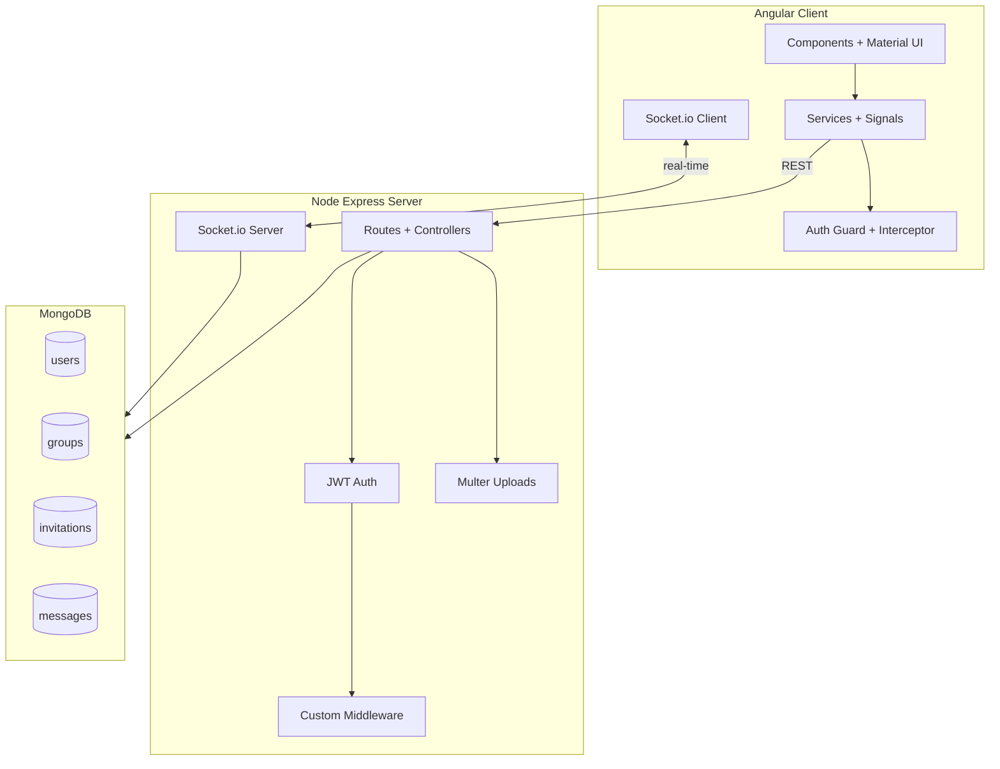
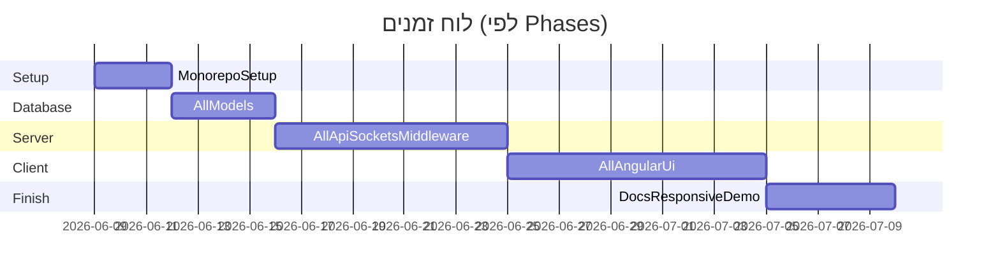

# תכנון עבודה — פרויקט צ'אט (Node.js + Angular + MongoDB)

**מסמכים קשורים:**
- [work-tamar-zisman.md](work-tamar-zisman.md) — קובץ עבודה אישי (תמר)
- [work-shoshi-sefrai.md](work-shoshi-sefrai.md) — קובץ עבודה אישי (שושי)

---

## סמן מיקום

| | |
|---|---|
| **שלב נוכחי** | Phase 1 — Database |
| **משימה פעילה** | כל ה-Models (User, Group, Invitation, Message) |
| **Branch פעיל** | `feature/auth` / `feature/groups` (לפתוח) |
| **משימה עכשיו** | **DB קודם:** בניית כל ה-models. **אחר כך** Server (Phase 2), ולבסוף Client (Phase 3) |
| **עודכן לאחרונה** | 2026-06-10 |
| **עודכן על ידי** | שושי |

> עדכנו שדה זה בכל מעבר שלב — בסוף כל שבוע עבודה לפחות.

### איך לעדכן

1. בסיום משימה / מעבר Phase — עדכני את הטבלה + תאריך
2. הזיזי את `▶ **[שלב נוכחי]**` לכותרת השלב החדשה
3. עדכני גם את מסמכי העבודה האישיים (תמר + שושי) — סנכרון צוות

---

## סקירה

**פרויקט:** אפליקציית צ'אט Fullstack — ניהול קבוצות, משתמשים, הזמנות והודעות (CRUD מלא).

**צוות:** תמר זיסמן + שושי ספראי

**טכנולוגיות (גרסאות עדכניות):**
- **Server:** Node.js (LTS אחרון) + Express + Mongoose + JWT + bcrypt + Multer + Socket.io
- **Client:** Angular 20 (standalone components, Signals, Reactive Forms) + Angular Material + HttpClient
- **DB:** MongoDB Atlas (מומלץ) / Compass לייצוא מקומי
- **State:** Angular Signals + Services (לא NgRx)
- **Git:** Monorepo — `server/` + `client/` + README ראשי
- **שפה:** אנגלית, LTR

**עקרון חלוקה:** העבודה מאורגנת ב-**Phases גלובליים** לפי שכבה — קודם **כל מסד הנתונים** (Phase 1), אחר כך **כל השרת** (Phase 2), ולבסוף **כל הלקוח** (Phase 3). בתוך כל phase כל אחת **בעלים ראשית (~70%)** על חלק מהפיצ'רים והשנייה עושה **Code Review + משימות משניות חובה (~30%)**. כל אחת **חייבת** לגעת בכל שכבה (Schema, API, Middleware, Component, Service, Validation, Tests ידניים) לאורך ה-phases.

---

## ארכיטקטורה כללית



---

## מבנה Monorepo

```
node-angular-project/
├── README.md                  # תיאור כללי + הוראות הרצה
├── .gitignore
├── docs/                      # מסמכי קדם-הגשה
│   ├── work-plan.md           # תכנון עבודה ראשי (קובץ זה)
│   ├── work-tamar-zisman.md   # קובץ עבודה — תמר
│   ├── work-shoshi-sefrai.md  # קובץ עבודה — שושי
│   ├── server-analysis.md     # תרשים פעולות לפי משתמש
│   ├── database-analysis.md   # אוספים + קשרים
│   └── screens-analysis.md    # מסכים + קומפוננטות
├── server/
│   ├── .env.example
│   ├── README.md
│   ├── src/
│   │   ├── config/
│   │   ├── models/            # User, Group, Invitation, Message
│   │   ├── routes/
│   │   ├── controllers/
│   │   ├── middleware/        # auth, errorLogger, shabbatBlock (custom)
│   │   ├── services/
│   │   ├── sockets/
│   │   └── utils/
│   └── uploads/               # תמונות, אודיו, PDF
└── client/
    ├── .env.example
    ├── README.md
    └── src/app/
        ├── core/              # auth, interceptors, guards
        ├── shared/            # כפתורים, כרטיסים, טופס משותף
        └── features/
            ├── auth/
            ├── groups/
            ├── invitations/
            └── chat/
```

---

## מסד נתונים — 4 אוספים (מינימום 2)

| Collection | שדות עיקריים | קשרים |
|---|---|---|
| **users** | username, email, passwordHash, avatar (image), role (`user`/`admin`) | ref ב-groups, messages |
| **groups** | name, description, adminId, members[], avatar (image) | admin → users, members → users |
| **invitations** | groupId, invitedUserId, invitedBy, status (`pending`/`accepted`/`rejected`) | refs → groups, users |
| **messages** | groupId, senderId, text, attachments[] (image/audio/pdf), timestamps | refs → groups, users |

**דרישות Mongoose (חובה):** כל model יכלול לפחות אחד מ: `pre` hook (hash password), `static` method (findByEmail), `toJSON` (הסתרת password).

**סוגי מדיה (חובה):**
- **טקסט** — תוכן הודעות, שמות קבוצות
- **תמונות** — avatar משתמש/קבוצה (Multer)
- **אודיו** — קובץ מצורף להודעה
- **PDF** (אופציונלי) — קובץ מצורף נוסף

---

## סוגי משתמשים והרשאות

| פעולה | משתמש רגיל | מנהל קבוצה (יוצר) |
|---|---|---|
| הרשמה / התחברות | ✓ | ✓ |
| צפייה בקבוצות שלי | ✓ | ✓ |
| יצירת קבוצה (הופך למנהל) | ✓ | ✓ |
| הזמנת משתמש לקבוצה | ✓ (חבר) | ✓ |
| קבלה/דחיית הזמנה | ✓ | ✓ |
| מחיקת חבר מקבוצה | ✗ | ✓ |
| CRUD הודעות + קבצים | ✓ (שלו) | ✓ |
| יציאה מקבוצה | ✓ | ✓ |
| מחיקת קבוצה | ✗ | ✓ |

**Auth:** JWT ב-Header, `AuthGuard` + `RoleGuard` / `GroupAdminGuard` ב-Angular, `authMiddleware` + `isGroupAdmin` בשרת.

---

## מסכים וקומפוננטות (Client)

| מסך | Route | קומפוננטות |
|---|---|---|
| Login | `/login` | LoginForm |
| Register | `/register` | RegisterForm |
| Dashboard | `/groups` | GroupList, GroupCard |
| Create/Edit Group | `/groups/new`, `/groups/:id/edit` | GroupForm (shared — id param) |
| Group Detail / Chat | `/groups/:id` | ChatRoom, MessageList, MessageItem, MessageForm |
| Invitations | `/invitations` | InvitationList, InvitationActions |
| Profile | `/profile` | ProfileForm, AvatarUpload |
| Navbar | global | NavBar (links לפי auth state) |
| Routes | global | AppRoutes |

**דרישות UI:** Angular Material, Responsive (Desktop: sidebar + chat / Mobile: hamburger + full-width), **ללא inline styles**, CSS/SCSS נפרד לפי צורך.

---

## API Endpoints (Server)

```
POST   /api/auth/register
POST   /api/auth/login
GET    /api/auth/me

GET    /api/groups
POST   /api/groups
GET    /api/groups/:id
PUT    /api/groups/:id          # admin only
DELETE /api/groups/:id          # admin only
POST   /api/groups/:id/leave
POST   /api/groups/:id/invite
DELETE /api/groups/:id/members/:userId  # admin only

GET    /api/invitations
PUT    /api/invitations/:id/accept
PUT    /api/invitations/:id/reject

GET    /api/groups/:id/messages
POST   /api/groups/:id/messages         # + multer
PUT    /api/messages/:id                # owner only
DELETE /api/messages/:id                # owner or admin
```

**Socket.io events:** `joinGroup`, `leaveGroup`, `newMessage`, `messageUpdated`, `messageDeleted`

---

## Custom Middleware (חובה — כל אחת אחד)

| Middleware | בעלים | תיאור |
|---|---|---|
| `errorLogger` | **תמר** | ב-dev: console; ב-production: כתיבה לקובץ log |
| `requestValidator` / `rateLimiter` | **שושי** | middleware creator — factory function עם פרמטרים |

דוגמה ל-pattern (middleware creator):
```javascript
const createRateLimiter = (maxRequests, windowMs) => (req, res, next) => { ... }
```

---

## חלוקת עבודה — תמר זיסמן vs שושי ספראי

### עקרון: "Phases גלובליים + Primary/Secondary"

העבודה מתקדמת **שכבה אחר שכבה** עבור כל הפיצ'רים יחד:
**Phase 1 = כל ה-DB → Phase 2 = כל השרת → Phase 3 = כל הלקוח → Phase 4 = גימור.**
בכל phase הבעלים הראשית עושה ~70% והמשנית ~30% (Review + משימות חובה).

---

### Phase 0 — הקמה משותפת (יום 1–2, **שתיהן ביחד**) ✓

- [x] יצירת Monorepo + GitHub repo
- [x] `server`: Express scaffold, `.env`, חיבור MongoDB
- [ ] `client`: `ng new` עם routing, Material, standalone *(routing + standalone ✓; Material — Phase 3)*
- [x] הגדרת `.env.example` בשני הצדדים
- [x] הסכמה על conventions: naming, branch strategy (`main`, feature branches)
- [x] יצירת `docs/` עם templates לקדם-הגשה

---

### ▶ **[שלב נוכחי]** Phase 1 — Database (כל ה-Models)

> בונים את **כל ארבעת ה-collections** לפני כתיבת השרת. כל model עומד בדרישות Mongoose (`pre` hook / `static` / `toJSON`).

| Model | Primary | Secondary |
|---|---|---|
| **User** [Auth] — pre hash, toJSON, role | תמר | שושי (Review + `findByEmail`) |
| **Group** [Groups] — refs, validation, indexes, `findForUser` | שושי | תמר (Review + indexes) |
| **Invitation** [Invitations] — status enum, `findPendingForUser` | תמר | שושי (Review) |
| **Message** [Messages] — attachments schema, `findByGroup`, toJSON | שושי | תמר (Review + toJSON transform) |

**תוצר:** 4 collections מוגדרים ונבדקים (users, groups, invitations, messages).

---

### Phase 2 — Server (API / Middleware / Sockets / Validators)

> אחרי שכל ה-models מוכנים. כל endpoint נבדק ב-Thunder Client לפני Phase 3.

| פיצ'ר | Primary | Secondary |
|---|---|---|
| **Auth** — `authMiddleware` (JWT), `errorLogger`, auth controllers, routes, express-validator | תמר | שושי (Review + validation, Thunder test) |
| **Groups** — `isGroupAdmin`/`isGroupMember`, CRUD + leave + invite, routes, validation | שושי | תמר (Review + Thunder test) |
| **Invitations** — controller (list/accept/reject/count), routes, `POST /:id/invite` | תמר | שושי (Review) |
| **Messages** — controller CRUD, Multer upload, `createRateLimiter`, Socket.io server + room events, routes | שושי | תמר (Review `createRateLimiter`) |
| **Admin** — `DELETE /:id/members/:userId`, `PUT /api/auth/me` + avatar | תמר | שושי (Review) |

**Socket.io events:** `joinGroup`, `leaveGroup`, `newMessage`, `messageUpdated`, `messageDeleted`.

**תוצר:** כל ה-REST endpoints + Socket.io עובדים ונבדקו ב-Thunder Client.

---

### Phase 3 — Client (Angular)

> אחרי ש-API יציב. מתחילים ב-`ng add @angular/material` (שושי).

| פיצ'ר | תמר | שושי |
|---|---|---|
| **Auth UI** | RegisterComponent + AuthService (Signals) | `ng add material`, Login, AuthGuard, HTTP interceptor |
| **Groups UI** | NavBar (links לפי auth state) | GroupService + Signal, GroupList/Card/Form (add/edit by id) |
| **Invitations UI** | InvitationService + List + Actions, route `/invitations` | Badge/count ב-NavBar + confirm dialog לפני reject |
| **Messages UI** | SocketService + listeners + MessageItem (edit/delete own) | MessageService + ChatRoom/List/Form + file preview |
| **Profile/Admin UI** | MemberManagementPanel + AvatarUpload (user) | ProfileComponent + group avatar upload |
| **Validation** | Client Reactive Forms validators | Client file picker (type/size) |

**תוצר:** כל המסכים עובדים מקצה לקצה מול ה-API.

---

### Phase 4 — גימור משותף (שבוע אחרון)

**שתיהן — חובה:**

| נושא | תמר | שושי |
|---|---|---|
| Responsive pass | Desktop layout (sidebar) | Mobile layout (hamburger) |
| `docs/server-analysis.md` | תרשים Admin | תרשים Regular User |
| `docs/database-analysis.md` | Collections 1–2 | Collections 3–4 |
| `docs/screens-analysis.md` | Auth + Groups screens | Chat + Invitations screens |
| README | Server README | Client README |
| Thunder Client / Compass export | Export collections | Export collections |
| Git | Merge feature branches | PR reviews |
| Demo prep | Auth + Groups flow | Chat + Invitations flow |

---

## מטריצת כיסוי — וידוא שכל אחת נוגעת בכל חלק

| תחום | תמר | שושי |
|---|---|---|
| MongoDB Schema | User, Invitation | Group, Message |
| API Controllers | Auth, Invitations | Groups, Messages |
| Custom Middleware | authMiddleware, errorLogger | isGroupAdmin, rateLimiter creator |
| Angular Components | Login, Invitations, Chat | Register, Groups, Profile |
| Services + Signals | AuthService | GroupService, MessageService |
| Forms + Validation | Register, Invitation | Login, Group, Message |
| File Upload | Avatar | Message attachments |
| Socket.io | Client integration | Server setup |
| Responsive UI | Desktop | Mobile |
| Documentation | Server analysis | DB + Screens analysis |

---

## ספריות npm נוספות (לבחירה)

- **Server:** `express-validator`, `winston` (logging), `socket.io`
- **Client:** `socket.io-client`, ספרייה נוספת לבחירה (למשל `date-fns` לתאריכים)

---

## לוח זמנים מוצע (6 שבועות)



| Phase | מטרה | תמר (Primary) | שושי (Primary) |
|---|---|---|---|
| 0 | Setup (Monorepo, env, conventions) | משותף | משותף |
| 1 | Database — כל ה-Models | User, Invitation | Group, Message |
| 2 | Server — API, Middleware, Sockets | Auth, Invitations, Admin | Groups, Messages, Socket.io server |
| 3 | Client — כל ה-Angular UI | Register, NavBar, Invitations, MessageItem, MemberPanel | Login/Guard/interceptor, Groups, Chat, Profile |
| 4 | גימור — Docs, Responsive, Demo, Deploy (Render — בונוס) | Desktop + Admin docs | Mobile + User docs |

**דדליין הגשה:** י"א כסלו תשפ"ו (לפי מסמך הדרישות)

---

## מסמכי קדם-הגשה (חובה)

1. **`docs/server-analysis.md`** — תרשים פעולות לפי סוג משתמש (Mermaid flowchart)
2. **`docs/database-analysis.md`** — 4 collections, שדות, refs, validation rules
3. **`docs/screens-analysis.md`** — כל מסך + רשימת קומפוננטות + routing tree

---

## הגשה סופית — Checklist

- [ ] GitHub Monorepo עם README מלא
- [ ] `server/.env.example` + `client/.env.example`
- [ ] Server README + Client README
- [ ] MongoDB Atlas connection / Compass export
- [ ] Thunder Client collection (מומלץ)
- [ ] Demo: שתיהן מציגות כל חלק (Auth, Groups, Invitations, Chat, Admin, Real-time)
- [ ] (בונוס) Deploy ל-Render

---

## Git Workflow מומלץ

```
main
├── feature/auth          (תמר)
├── feature/groups        (שושי)
├── feature/invitations   (תמר)
├── feature/chat-realtime (שושי)
└── feature/polish        (שתיהן)
```

כל feature branch → Pull Request → Review על ידי הפרטנרית → Merge ל-main.
